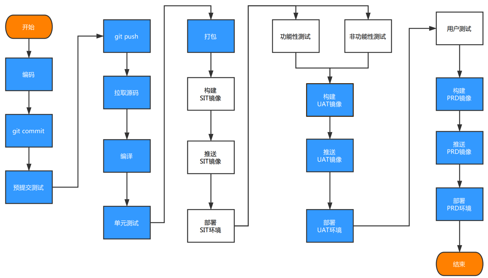
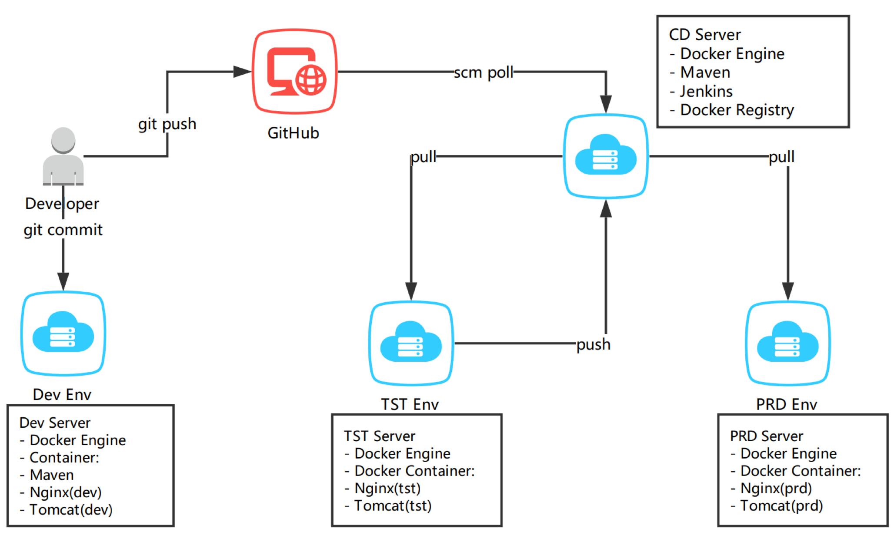
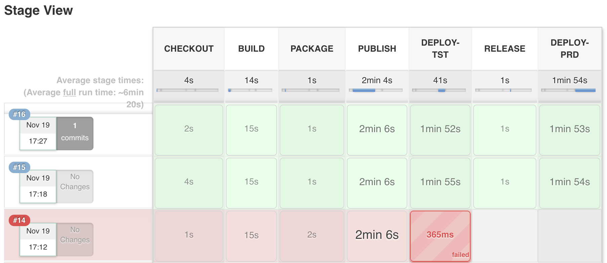

# 设计思路
- 交付流水线分为开发、测试和生产三个环境，使用 Jenkins Pipeline 实现交付的自动化；
- 开发者在开发环境commit之后即可进行预提交测试，通过后push即可触发交付件自动构建和测试、生产环境的自动部署；
- 使用 Docker 镜像和容器实现交付件和运行时的标准化和不同环境的一致性；
- 使用 GitHub 作为源码和配置管理，Registry作为制品和版本管理。

## Demo流程
  
注:demo仅包含蓝色部分

## Demo环境
    

- Web访问地址  
`http://HOST_IP:8080`
- App访问地址  
`http://HOST_IP:8880`

# 文件结构

## Jenkinsfile     
- Jenkins Pipeline 配置文件 

## myweb 源码目录  
- myweb/Dockerfile.App (构建App Dockerfile)  
- myweb/Dockerfile.Web (构建Web Dockerfile)  
- myweb/src (APP源码 war)  
- myweb/web (WEB码 zip)  

##scripts 脚本目录
- scripts/initCDSrv.sh ( CI/CD 服务器初始化脚本)  
- scripts/initEnv.sh (开发/测试/生产环境 Docker 安装配置脚本)  
- scripts/post-commit (开发环境应用启动 hook)  
- scripts/startApp.sh（测试/生产环境应用启动脚本）  

# 部署方式
1. 准备好每个环境需要的服务器  
注: 本Demo仅在CentOS 7下做过测试  
  
2. 将仓库克隆到每台服务器  
 `git clone https://github.com/myownsoul/hometest.git`   
  
3. 初始化开发/测试/生产的服务器  
 `scripts/initEnv.sh`       
  
4. 初始化持续集成/持续部署服务器  
 `scripts/initCDSrv.sh`     
  
5. 配置 Jenkins   
   - 插件安装:
   > CloudBees Docker Build and Publish plugin  
   > Git plugin  
   > GitHub plugin  
   > Maven Integration plugin  
   > Pipeline  
   
   
   - 工具配置:
   > JDK(JAVA\_HOME)
   `/usr/lib/jvm/java-1.8.0-openjdk-1.8.0.151-1.b12.el7_4.x86_64`
   > Git(Path)  
   `/usr/bin/git`  
   > Maven(MAVEN\_HOME)  
   `/usr/share/maven`  
   > Docker(Root)  
   `/usr/bin`
  
6. 新建`Pipeline Item`并完成`SCM`配置。  

  **Pipeline Sample**
   
  
  注: 根据实际的环境修改`Jenkinsfile`的环境变量  

      
# 生产环境考量  

  
